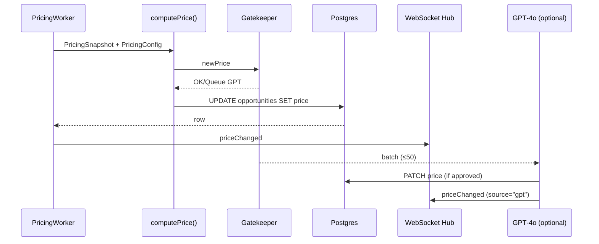

# QuoteBid Pricing Agent – Runbook & Spec

**TL;DR:** Re‑prices every live opportunity each tick, clamped to a dynamic value band, using demand + time pressure + outlet anchors; writes to DB, emits WebSocket, never emails while flags are off.

## 1 · Purpose & Role Overview

| Item | Details |
|------|---------|
| **Job title** | Real‑time Pricing Agent (QuoteBid) |
| **Mission** | Continuously discover the fair‑market access price for every live editorial opportunity, balancing demand signals with time pressure while keeping prices inside a rational value band. |
| **North‑star** | Engine must feel stable yet responsive — never manic, never stagnant. |

### Core responsibilities

| Responsibility | Why it matters |
|----------------|----------------|
| **Price discovery** | Ensures experts pay a fair, demand‑driven fee & journalists see balanced pitch volume. |
| **Guardrails** | Prevents cliff‑drops, whiplash & user distrust via dynamic floor/ceiling, cooldown, min‑tick. |
| **Demand ingestion** | Captures true interest (pitches + page clicks + email clicks, EMA‑smoothed). |
| **Timeliness** | Runs every tickIntervalMs, hot‑reloads admin config. |
| **Auditability** | Records snapshot → DB, emits WS update, leaves verifiable trail. |
| **Non‑intrusive notifications** | Sends price‑change alerts only when feature flags permit. |

### Success criteria (⇢ auto‑monitored)

- Avg price drift / h ≤ 15% of tier baseline
- Zero price change < $10 within 15 min of previous change
- 0 un‑flagged price‑change emails/pushes while feature flags are false
- 95%+ of GPT decisions respect band & cooldown
- Latency: tick < 1s / GPT batch RT < 3s

## 2 · High‑level flow diagram

## 3 · Inputs & Source Tables

| Metric | Source table | Notes |
|--------|--------------|-------|
| **pitches** | `pitches` | `isDraft = false` |
| **opp_click (1h)** | `events` | `type = 'opp_click'` |
| **email_click (1h)** | `events` | `type = 'email_click'` |
| **hoursRemaining** | `opportunities.deadline` | |
| **outlet_avg_price** | `outlets.avg_price` | nullable |
| **successRateOutlet** | `outlets.success_rate` | 0‑1 |

## 4 · Config knobs (Admin UI → pricing_config)

- **priceStep** – $ scalar applied after delta scaling
- **tickIntervalMs** – worker heartbeat
- **FEATURE_FLAGS** – ENABLE_PRICE_EMAILS / ENABLE_PRICE_PUSHES
- **Weight keys** – pitches, clicks, saves, drafts, emailClickBoost, etc.

## 5 · Algorithm (plain English)

1. **Demand score** = Σ (weightᵢ × metricᵢ)
2. **Supply pressure** = log decay when < 24h; linear otherwise
3. **Yield pull** = move toward outlet_avg_price when available
4. **Risk adj** = (1 – successRateOutlet) × weight
5. **Delta** = elasticity × demand + yield – supply – risk
6. **Move** = round(delta × priceStep)
7. **Cooldown / tick filter**: skip if < $10 or last change < 15 min
8. **Clamp** to [floor, ceiling] where:
   - `floor = max(cfg.floor, 0.6 × anchor)`
   - `ceiling = min(cfg.ceil, 2.0 × anchor)`
   - `anchor = outlet_avg_price || tierBase`

## 6 · Output contract

- **REST** `PATCH /opportunities/:id` → `{ price: number }`
- **WebSocket** `priceChanged` → `{ id, oldPrice, newPrice, trend, source }`
- **Audit** row in `price_snapshots` every update

## 7 · Notification rules (currently gated)

| Template | When fires | Guard |
|----------|------------|-------|
| **PRICE_DROP** | reduce > $10 | `FEATURE_FLAGS.ENABLE_PRICE_EMAILS` |
| **LAST_CALL** | hrsRemaining < 6 & high demand | same |

## 8 · Operational playbook

| Scenario | Action |
|----------|--------|
| **Soft freeze** | set `PRICING_ENGINE_PAUSED=true`; worker logs but skips DB writes |
| **Manual override** | `PATCH /opportunities/:id` with `x-admin-token`, logs to `system_events` |
| **DB conflict** | auto‑retry 3× w/ 100ms back‑off, then alert |
| **GPT 5xx** | exponential back‑off → skip batch if still failing |

## 9 · Observability & SLOs

| Metric | Target | Alert |
|--------|--------|-------|
| **Tick latency p95** | < 1s | page @ 2s |
| **Price updates / h** | 0–4 | warn @ > 8 |
| **Band violations** | 0 | page immediately |
| **GPT fallback rate** | < 10% | slack‑ping |

**Linked Grafana dashboard UID:** `qbid‑pricing‑live`

## 10 · Security & PII

- Only IDs & counts leave DB; no user PII passes to GPT
- GPT payload capped at 1k tokens, scrubbed by `redactPII()`

## 11 · Data retention

- `price_snapshots` → keep 30d, then archive to S3
- `events` (clicks/pitches) → 90d, then drop

## 12 · Glossary

- **Band** – dynamic floor/ceiling price range
- **Delta** – signed result of pricing formula step 5
- **Tick** – single execution of `processPricingTick()`
- **EMA** – exponential moving average
- **Hysteresis** – memory preventing instant reversal of prior move
- **Yield pull** – force nudging price toward an outlet's historical avg

## 13 · Version history

| Date | Author | Change |
|------|--------|--------|
| 2025‑01‑16 | Claude (AI) | Initial spec v1.0 